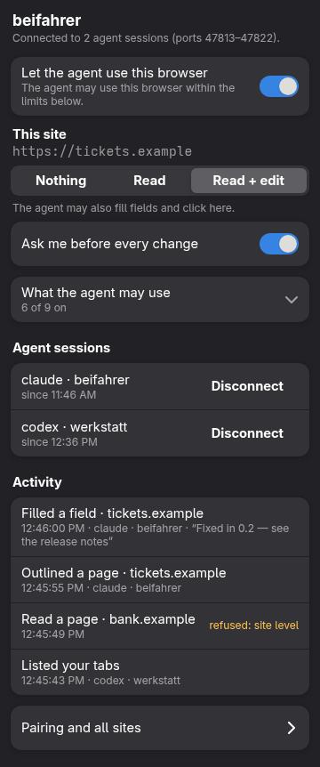
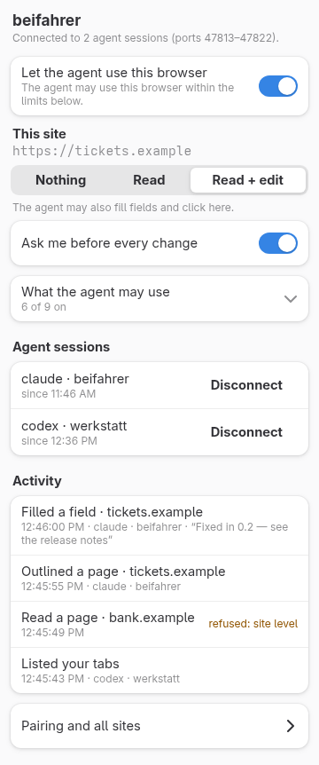
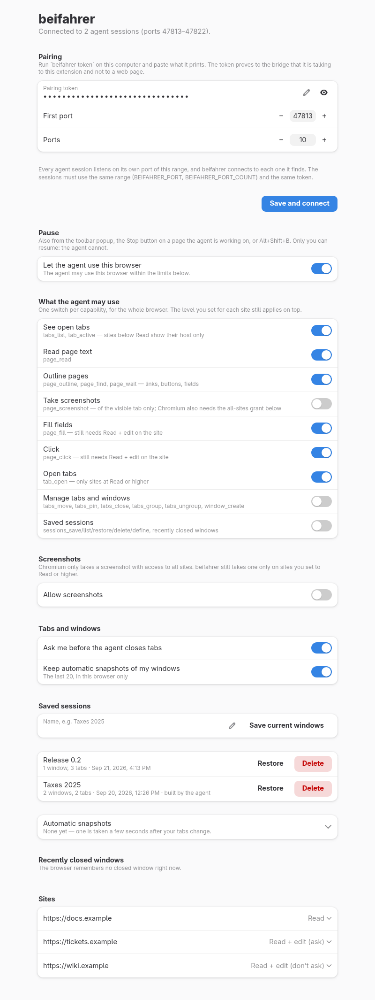
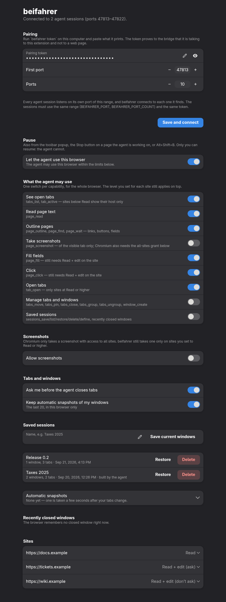
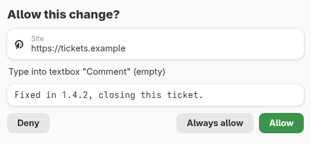
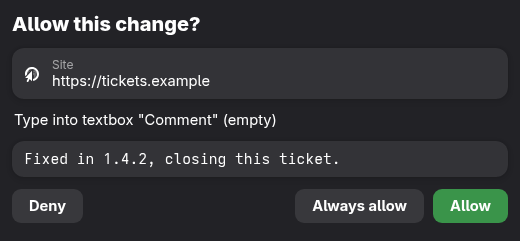
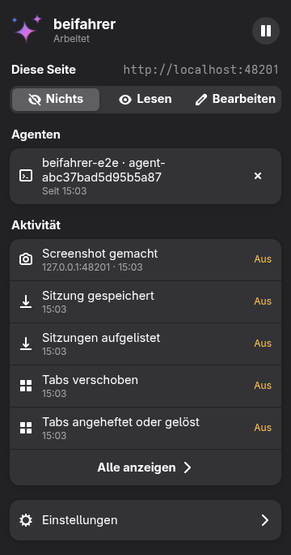
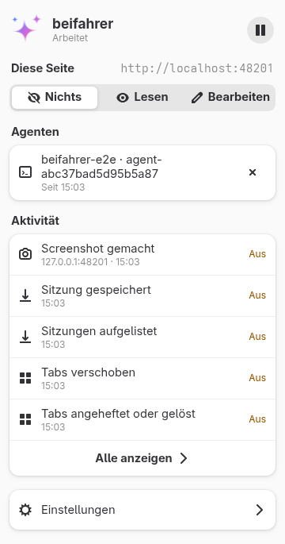
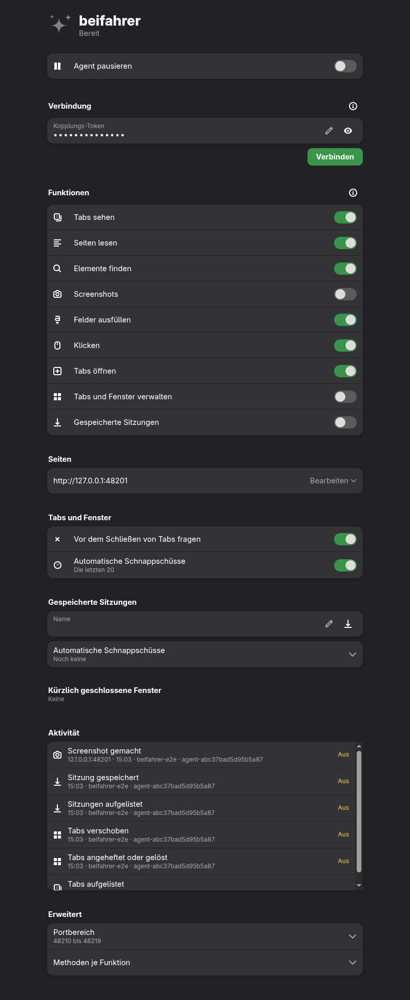

# beifahrer

**Let an AI agent ride along in the browser you already use, with you in the driver's seat.**

Agents keep needing the browser that is already open in front of you. They need to know which tab
you are looking at, to read a page you are logged into, or to rewrite a ticket description in
place while you watch. The usual tools start a *separate* browser with no sessions and no idea of
what you see. The ones that attach to your own browser only work with Chromium.

beifahrer is a WebExtension for **Firefox and Chromium-based browsers** plus a small local
**MCP server**. The agent gets a narrow set of tools: list tabs, read a page, outline its fields,
find an element by name, wait for a page, take a screenshot, fill a field, click, open a URL, run
a recipe, and, if you allow it, sort, pin, close, save and reopen your tabs. **You decide, site by site, what it may do.**

> **Status: early (0.1).** Works end-to-end in Chromium and Firefox. Not yet on the add-on stores.

## How it works

```
Firefox / Chromium
  └─ beifahrer extension ─ WebSocket, 127.0.0.1 only, paired with a token ─┐
                                                                            │
                                        beifahrer mcp  (MCP over stdio) ────┘
                                               │
                                             agent
```

- The **extension** connects to the bridge on loopback. It serves requests only after you have
  paired it once with a token, and the bridge refuses any connection whose origin is a web page.
- The **bridge** (`beifahrer mcp`) is an MCP server over stdio that your agent starts. It routes
  requests and holds no policy.
- **Every agent session gets its own connection.** Each `beifahrer mcp` listens on the first free
  port of 47813–47822, and the extension looks for sessions on that range every few seconds and
  connects to each one it finds. Sessions never go through each other, so a session started from
  an older build cannot hold back a newer one. All of them read the same token file. The popup
  lists the connected sessions by name (the agent and the folder it works in, e.g.
  "claude-code · werkstatt", or `BEIFAHRER_SESSION_LABEL`), and **Disconnect** shuts one out
  until it restarts. Why: [ADR 0007](docs/adr/0007-one-connection-per-agent-session.md).
- The **policy lives in your browser.** Every site is at one of three levels:

  | Level | The agent may |
  |---|---|
  | **Nothing** (default) | see that a tab on that site is open (host only: no title, no path) |
  | **Read** | read the text, get an outline of links, buttons and fields, take a screenshot (if screenshots are on) |
  | **Read + edit** | also fill fields and click. You confirm each change in a browser window unless you switch that off for the site. |

  When you raise a site's level, the browser asks you to grant access to that site. beifahrer has
  no host access until you do.

## Seeing it, and stopping it

**The toolbar button tells you what is going on.** Its icon is a set of sparkles:

| Icon | Means |
|---|---|
| grey sparkles | connected to an agent, nothing happening |
| **coloured** sparkles | an agent is using this browser right now (and for 5 s after its last request) |
| grey + **red dot** | paused: the agent gets nothing |
| grey + **amber dot** | not paired, or no agent running: nothing can reach the browser |

Hover it for the same in words. Click it for the popup: one word of state and the pause button at
the top, the level of the site you are on, the connected **agent sessions**, and the last few
entries of the **activity** (what, which site by host, when, which session, and why a request was
refused; the options page shows all of them). The activity list holds no page text
and is gone when the browser closes.

<p>
  
  
</p>

The popup, the options page and the confirmation window are built with
[`@gjsify/adwaita-web`](https://github.com/gjsify/gjsify), so they look like GNOME's own settings
under GNOME and like a plain, consistent settings page elsewhere. Light and dark follow your
system. They speak **English and German** so far, chosen by your browser's language; the store
listing does too. Adding a language is one file, `extension/_locales/<lang>/messages.json`
([ADR 0008](docs/adr/0008-ui-on-adwaita-web.md)). They say only what is not normal: a banner when
the agent is paused or cannot connect, explanations behind an info button
([ADR 0009](docs/adr/0009-quiet-pages.md)).

The pages and the in-page pill use your GNOME accent colour (GNOME 47+): every agent session's
bridge reads it and tells the extension, which keeps the latest one, so this works in every
browser. Without it they use the browser's own accent where it has one, otherwise Adwaita blue.
Light and dark follow the *browser's* setting: in Firefox, the theme "System theme — auto" and
Website appearance "Automatic"; in Chrome, Appearance → Mode "Device".

<details>
<summary>The options page, the confirmation window, and the popup in German</summary>
<p>
  
  
</p>
<p>
  
  
  
  
  
</p>
</details>

The pictures show the e2e's synthetic fixture page, never a real site.

**While the agent reads or edits a page, the page shows it**: a small pill, "Agent is
reading" or "Agent is editing", with a **Stop** button, top right. It disappears a few seconds after
the last action, never appears in a screenshot, and the page itself cannot read it.

**Pause stops everything at once.** Press *Stop* on that pill, the pause button in the popup, the switch in the
options, or press **Alt+Shift+B** (**⌥⇧B** on macOS). While paused, every tool the agent calls, even listing tabs,
answers `paused`, and the agent is told to ask you. Only you can resume, in the popup, the options
or with the shortcut: nothing the agent sends can.

**Features.** On top of the per-site levels, you choose which capabilities the agent may use at
all (options page):

| Feature | Tools | Default |
|---|---|---|
| See open tabs | `tabs_list`, `tab_active` (sites below *Read* show their host only) | on |
| Read page text | `page_read` | on |
| Outline pages | `page_outline` | on |
| Screenshots | `page_screenshot` (turning it on asks the browser for access to all sites) | **off** |
| Fill fields | `page_fill`, still only at *Read + edit*, and you confirm | on |
| Click | `page_click`, still only at *Read + edit*, and you confirm | on |
| Open tabs | `tab_open`, only sites at *Read* or higher | on |
| Manage tabs and windows | `tabs_move`, `tabs_pin`, `tabs_close`, `tabs_group`, `tabs_ungroup`, `window_create` | **off** |
| Saved sessions | `sessions_*` | **off** |

A tool whose feature is off answers `feature_disabled` and names the feature. Why and how:
[ADR 0005](docs/adr/0005-the-person-sees-and-stops-the-agent.md).

## Tabs, windows and saved sessions

Two features, **"Manage tabs and windows"** and **"Saved sessions"** (popup and options, both off
by default), let the agent tidy up your browser for you:

| Tool | Does |
|---|---|
| `tabs_move`, `tabs_pin` | reorder tabs (also into another window), pin and unpin |
| `tabs_close` | close tabs or a whole window. You confirm in a window that lists them, unless you switch that off |
| `tabs_group`, `tabs_ungroup` | tab groups, where the browser has them (Chromium, Firefox ≥ 139) |
| `window_create` | a new window with new tabs and/or tabs moved over |
| `sessions_save`, `sessions_list`, `sessions_restore`, `sessions_delete` | save windows (order, pins, groups) under a name and reopen them later, lazily |
| `sessions_define` | a workspace the agent puts together for a task |
| `sessions_recently_closed`, `sessions_restore_closed` | the browser's own list of closed windows and tabs |

Sessions are stored **in your browser**, not with the agent ([ADR 0004](docs/adr/0004-sessions-live-in-the-browser.md)).
The options page lists them with Restore and Delete, saves the current windows under a name, and
shows your recently closed windows. It works without any agent. It also keeps automatic
snapshots of your windows (the last 20), so a window you close by mistake comes back in one click.

The per-site levels still apply: the agent sees a saved tab on a site below *Read* as its host
only, and it can only put URLs of sites at *Read* or higher into a new window or workspace.

## Recipes

Some tasks take the same few steps on the same web app every time. On an OpenProject work
package, for example, the comment box is a button until you click it, the editor appears a
moment later, and only then can text go in. A **recipe** writes such a task down once, as data:

| Tool | Does |
|---|---|
| `page_find` | elements by role and accessible name ("the button named Submit comment"), with refs for fill and click |
| `page_wait` | wait for a tab to finish loading, or for an element to appear (up to 30 s) |
| `recipes_list` | every recipe beifahrer knows, where it came from, and files it refused |
| `recipes_for_tab` | the recipes that fit a tab, by URL or by recognising the app on the page |
| `recipe_run` | run one step by step; stops at the first failing step and names it |

A recipe only has steps like *find*, *click*, *fill*, *wait* and *read*, each an ordinary
beifahrer call. **The browser checks every step like a call the agent made itself**: the site's
level, your confirmation, the Stop button. A recipe carries no code. A step that publishes
(posting the comment, saving) runs only when the agent says you asked for exactly that.
Otherwise the run stops before it and leaves the draft on the page for you to read.

beifahrer ships `openproject/add-comment` and `openproject/edit-description`. They recognise
OpenProject on any domain. Your own recipes go in `~/.config/beifahrer/recipes/` or in the
directories listed in `$BEIFAHRER_RECIPES` (colon-separated). A later source replaces a recipe
with the same id. **This repository is public:** recipes that name a company, a customer's domain
or an internal process belong in your own directory. Format and how to contribute:
[recipes/README.md](recipes/README.md). Why it is built this way:
[ADR 0006](docs/adr/0006-recipes-are-data-run-as-ordinary-calls.md).

## What it will never do

- **Run arbitrary JavaScript for the agent.** There is no `evaluate`: every action is one of the
  tools above, so the levels mean what they say.
- **Fill a password field.** You type those yourself.
- **Hold your credentials.** It uses the session you are already logged into.
- **Send anything off your computer.** The only channel is the loopback socket to the bridge you
  run yourself.
- **Switch your tab behind your back.** A screenshot is only taken of the tab you are showing.
- **Rearrange or close your tabs unless you let it.** Managing tabs and windows is a feature,
  off by default, and closing tabs asks you first.
- **Keep going after you press Stop.** Paused means every request is refused until you resume.

Page text is written by whoever runs the site, and an agent reading it can be steered by it
(prompt injection). That is the reason for the per-site levels: keep your bank at *Read*, and an
injected instruction has nothing to write with.

## Install (from source, for now)

Requires [gjsify](https://github.com/gjsify/gjsify) and GJS, nothing else: the app runs on GJS and the
extension is bundled on GJS too ([ADR 0002](docs/adr/0002-build-on-gjs-not-wxt.md)).

```sh
gjsify install
gjsify workspace beifahrer-cli build          # app/dist/beifahrer.gjs.mjs
gjsify workspace beifahrer-extension build    # extension/.output/{chrome-mv3,firefox-mv2}, on GJS
```

- **Chromium:** `chrome://extensions` → Developer mode → *Load unpacked* → `extension/.output/chrome-mv3`
- **Firefox, to try it:** `about:debugging#/runtime/this-firefox` → *Load Temporary Add-on* → `extension/.output/firefox-mv2/manifest.json`. Firefox forgets it on restart.
- **Firefox, to keep it:** sign it as an unlisted add-on (AMO signs it, nothing is published):
  put `WEB_EXT_API_KEY` / `WEB_EXT_API_SECRET` from [your AMO API key page](https://addons.mozilla.org/developers/addon/api/key/)
  into `~/.config/beifahrer/amo.env`, run `gjsify workspace beifahrer-extension sign`, and open
  the `.xpi` from `extension/.output/signed/` in Firefox.

Pair it:

```sh
gjsify run app/dist/beifahrer.gjs.mjs token   # prints the token; paste it in the extension's options
```

Register the MCP server with your agent. It needs `mcp`, and `--allow-write` if the agent may
fill and click at all (the browser still asks you):

```json
{
  "mcpServers": {
    "beifahrer": {
      "command": "gjsify",
      "args": ["run", "/path/to/beifahrer/app/dist/beifahrer.gjs.mjs", "mcp", "--allow-write"]
    }
  }
}
```

Then open a site, click the beifahrer toolbar button, and pick a level.

Ten sessions at once is the default. For more, raise the range on both sides to the same number:
`BEIFAHRER_PORT_COUNT` (or `--port-count`) for the bridges, and **Ports** in the extension options.

## Browsers

| | Chromium (Chrome, Brave, Edge, …) | Firefox | Epiphany (GNOME Web) |
|---|---|---|---|
| Manifest | MV3 | MV2 | MV2 |
| Status | ✅ | ✅ | ⏸ blocked upstream: [measured](docs/adr/0001-a-browser-extension-not-a-driven-browser.md#3-engine-support-is-measured-not-claimed) |

### Without an MCP client

`beifahrer tool` runs any MCP tool from the command line, through the same server and the same
gates. It listens on its own port of the range, like any agent session, and a call waits (up to
`--wait`, 20 s) for the extension to find it. That helps in a session that started before
beifahrer was registered, and it also works from scripts:

```sh
gjsify run app/dist/beifahrer.gjs.mjs tool --list
gjsify run app/dist/beifahrer.gjs.mjs tool tabs_list
gjsify run app/dist/beifahrer.gjs.mjs tool --allow-write recipe_run '{"tabId": 78, "id": "openproject/add-comment", "params": {"text": "…"}}'
```

## Development

```sh
gjsify workspace beifahrer-extension dev            # Firefox with the extension, rebuilt + reloaded on every change
gjsify workspace beifahrer-extension dev:chromium   # the same in Chromium (Playwright's build or $BEIFAHRER_E2E_CHROMIUM)
```

The dev browser runs in its own persistent profile (`~/.cache/beifahrer/dev-*`), is paired
automatically with your local token, and looks for sessions on ports **47830–47839**, so it never
meets the agent sessions of your everyday browser. Drive it with
`gjsify run app/dist/beifahrer.gjs.mjs call <method> --port 47830`.

```sh
gjsify workspace beifahrer-cli test           # unit tests, on GJS and Node
node tests/e2e/browsers.e2e.mjs all           # the full chain in headless Chromium + Firefox
```

Design decisions: [docs/adr/](docs/adr/). Contributor and agent rules: [AGENTS.md](AGENTS.md).

## License

[AGPL-3.0-or-later](LICENSE)
