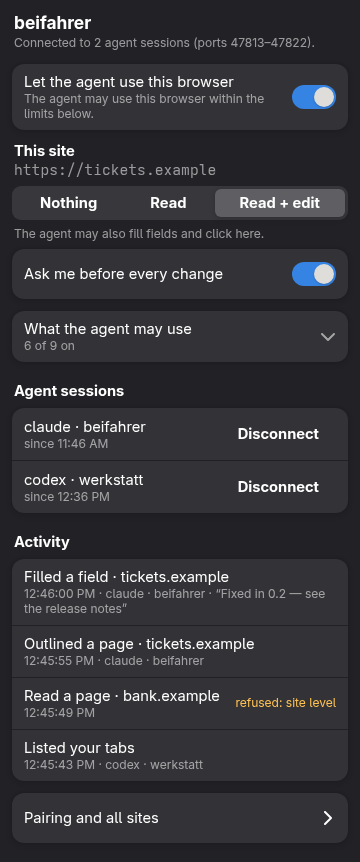
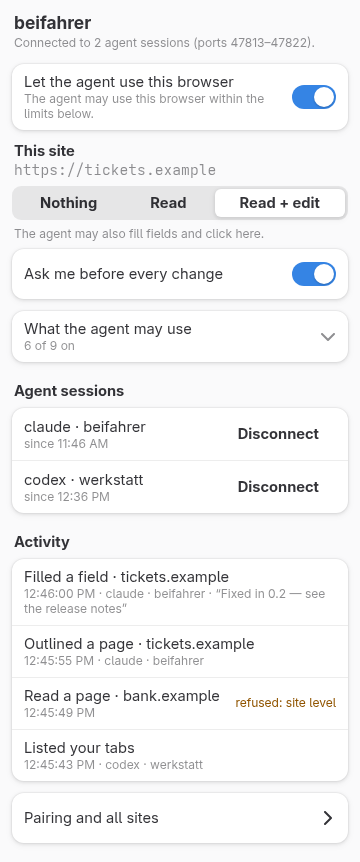
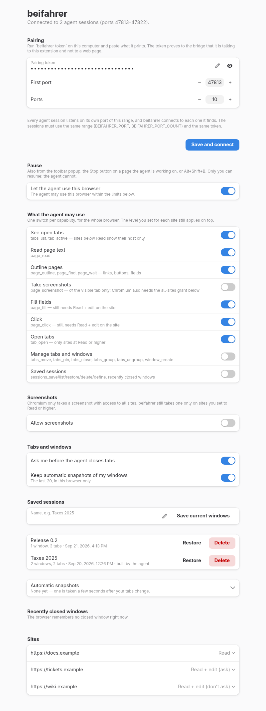
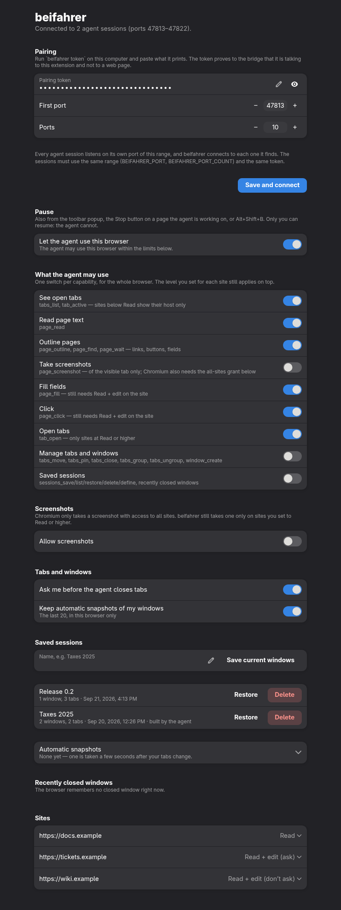
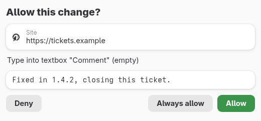
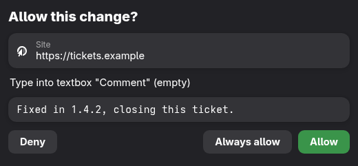
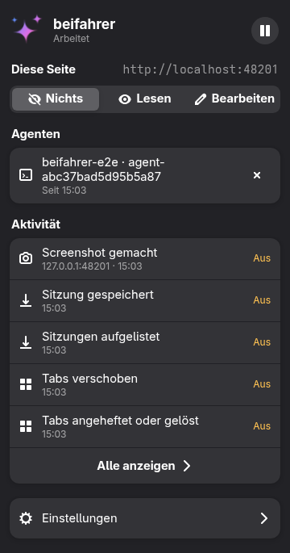
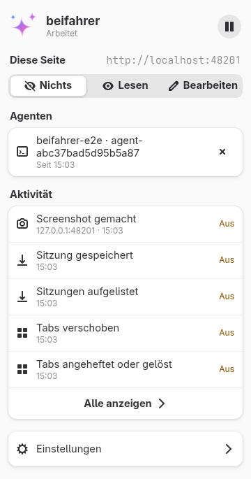
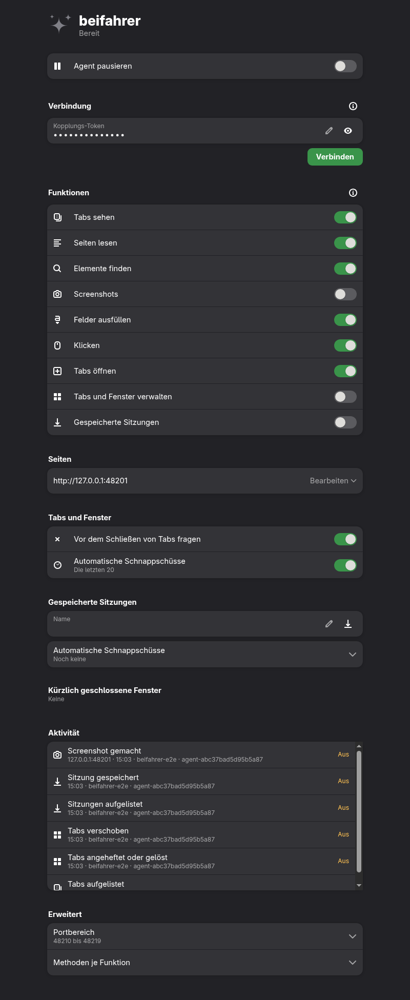

# beifahrer

**Let an AI agent ride along in the browser you already use, with you in the driver's seat.**

Agents keep needing the browser that is already open in front of you. They need to know which tab
you are looking at, to read a page you are logged into, or to rewrite a ticket description in
place while you watch. The usual tools start a *separate* browser with no sessions and no idea of
what you see. The ones that attach to your own browser only work with Chromium.

beifahrer is a WebExtension for **Firefox and Chromium-based browsers** plus a small local
**MCP server**. The agent gets a narrow set of tools: list tabs, read a page, outline its fields,
find an element by name, wait for a page, take a screenshot, fill a field, click, open a URL, run
a recipe, and, if you allow it, sort, pin, close, save and reopen your tabs. **You decide, site by site, what it may do.**

> **Status: early (0.1).** Works end-to-end in Chromium and Firefox. Not yet on the add-on stores.

## How it works

```
Firefox / Chromium
  └─ beifahrer extension ─ WebSocket, 127.0.0.1 only, paired with a token ─┐
                                                                            │
                                        beifahrer mcp  (MCP over stdio) ────┘
                                               │
                                             agent
```

- The **extension** connects to the bridge on loopback. It serves requests only after you have
  paired it once with a token, and the bridge refuses any connection whose origin is a web page.
- The **bridge** (`beifahrer mcp`) is an MCP server over stdio that your agent starts. It routes
  requests and holds no policy.
- **Every agent session gets its own connection.** Each `beifahrer mcp` listens on the first free
  port of 47813–47822, and the extension looks for sessions on that range every few seconds and
  connects to each one it finds. Sessions never go through each other, so a session started from
  an older build cannot hold back a newer one. All of them read the same token file. The popup
  lists the connected sessions by name (the agent and the folder it works in, e.g.
  "claude-code · werkstatt", or `BEIFAHRER_SESSION_LABEL`), and **Disconnect** shuts one out
  until it restarts. Why: [ADR 0007](docs/adr/0007-one-connection-per-agent-session.md).
- The **policy lives in your browser.** Every site is at one of three levels:

  | Level | The agent may |
  |---|---|
  | **Nothing** (default) | see that a tab on that site is open (host only: no title, no path) |
  | **Read** | read the text, get an outline of links, buttons and fields, take a screenshot (if screenshots are on) |
  | **Read + edit** | also fill fields and click. You confirm each change in a browser window unless you switch that off for the site. |

  When you raise a site's level, the browser asks you to grant access to that site. beifahrer has
  no host access until you do. Setting a site to *Nothing* blocks it: nothing below reaches it.
- **All sites, for a while.** In the popup, *All sites* lets the agent read (or edit) every site
  you have no rule for, for one hour, until the browser closes, or for one agent session. It is
  never permanent, the toolbar shows a blue dot while it lasts, and *End* stops it at once. Every
  change it allows still asks you first.
- **Asked when needed.** When the agent needs a site it has no level for, a window asks "*session*
  wants to read *site*": **Allow once**, **For this session**, **Always** (sets the site's level) or
  **Deny**. No answer within two minutes is a no. You can switch the asking off in the options.
  Why both: [ADR 0010](docs/adr/0010-temporary-access-and-asking-on-demand.md).

## Seeing it, and stopping it

**The toolbar button tells you what is going on.** Its icon is a set of sparkles, and the rows are
in the order they matter:

| Icon | Means |
|---|---|
| grey + **red dot** | **no agent is connected**: not paired, or no bridge running. Nothing can reach the browser, so the extension does nothing |
| grey + **yellow dot** | paused: the agent gets nothing |
| grey + **blue dot** | *All sites* is on for now (the sparkles still turn coloured while the agent works) |
| **coloured** sparkles | an agent is using this browser right now (and for 5 s after its last request) |
| grey sparkles | connected to an agent, nothing happening |

A missing connection outranks a pause: with no bridge there is nothing an agent could do anyway, and
it is the one thing only you can fix ([ADR 0014](docs/adr/0014-not-connected-speaks-first.md)).
Hover it for the same in words. Click it for the popup: one word of state and the pause button at
the top, a banner over the page when something is not normal (not connected → *Settings*, paused →
*Resume*), the level of the site you are on, the connected **agent sessions**, and the last few
entries of the **activity** (what, which site by host, when, which session, and why a request was
refused; the options page shows all of them). The activity list holds no page text
and is gone when the browser closes.

<p>
  
  
</p>

The popup, the options page and the confirmation window are built with
[`@gjsify/adwaita-web`](https://github.com/gjsify/gjsify), so they look like GNOME's own settings
under GNOME and like a plain, consistent settings page elsewhere. Light and dark follow your
system. They speak **English and German** so far, chosen by your browser's language; the store
listing does too. Adding a language is one file, `extension/_locales/<lang>/messages.json`
([ADR 0008](docs/adr/0008-ui-on-adwaita-web.md)). They say only what is not normal: a banner when
the agent is paused or cannot connect, explanations behind an info button
([ADR 0009](docs/adr/0009-quiet-pages.md)).

The pages and the in-page pill use your desktop's accent colour (GNOME 47+, or macOS): every
agent session's bridge reads it and tells the extension, which keeps the latest one, so this works in every
browser. Without it they use the browser's own accent where it has one, otherwise Adwaita blue.
Light and dark follow the *browser's* setting: in Firefox, the theme "System theme — auto" and
Website appearance "Automatic"; in Chrome, Appearance → Mode "Device".

<details>
<summary>The options page, the confirmation window, and the popup in German</summary>
<p>
  
  
</p>
<p>
  
  
  
  
  
</p>
</details>

The pictures show the e2e's synthetic fixture page, never a real site.

**While the agent reads or edits a page, the page shows it**: a small pill, "Agent is
reading" or "Agent is editing", with a **Stop** button, top right. It disappears a few seconds after
the last action, never appears in a screenshot, and the page itself cannot read it.

**Pause stops everything at once.** Press *Stop* on that pill, the pause button in the popup, the switch in the
options, or press **Alt+Shift+B** (**⌥⇧B** on macOS). While paused, every tool the agent calls, even listing tabs,
answers `paused`, and the agent is told to ask you. Only you can resume, in the popup, the options
or with the shortcut: nothing the agent sends can.

**Features.** On top of the per-site levels, you choose which capabilities the agent may use at
all (options page):

| Feature | Tools | Default |
|---|---|---|
| See open tabs | `tabs_list`, `tab_active` (sites below *Read* show their host only) | on |
| Ask before spending a call | `access_check` — what **would** happen if the agent called a method on a tab or a URL, answered without doing it: which switch is off, what the site is at, what the method needs, whether the browser has granted access, whether **you** would confirm | on |
| Read page text | `page_read` | on |
| Outline pages | `page_outline` | on |
| Screenshots | `page_screenshot` (turning it on asks the browser for access to all sites) | **off** |
| See page requests | `page_network` — what the tab asked for and what came back, never with query strings. Switching it on asks the browser for its `webRequest` permission, which is a request log of this whole browser | **off** |
| Fill in forms | `page_fill`, `page_press`, `page_select`, `page_check` — text into a field, keys into a form, a dropdown option, a checkbox. Still only at *Read + edit*, and you confirm | on |
| Click | `page_click`, still only at *Read + edit*, and you confirm | on |
| Run scripts | `page_evaluate` — the agent runs its own code in the page (Firefox only; Chromium's content-script policy forbids it), still only at *Read + edit*, and you see every script before it runs | **off** |
| Point the browser at a URL | `tab_open`, `page_navigate` — only sites at *Read* or higher | on |
| Manage tabs and windows | `tabs_move`, `tabs_pin`, `tabs_close`, `tabs_group`, `tabs_ungroup`, `window_create` | **off** |
| Saved sessions | `sessions_*` | **off** |

A tool whose feature is off answers `feature_disabled` and names the feature. Why and how:
[ADR 0005](docs/adr/0005-the-person-sees-and-stops-the-agent.md).

## Tabs, windows and saved sessions

Two features, **"Manage tabs and windows"** and **"Saved sessions"** (popup and options, both off
by default), let the agent tidy up your browser for you:

| Tool | Does |
|---|---|
| `page_navigate` | move a tab: to a URL, or `back` / `forward` / `reload`. Waits for the new page to load, so the next call reads the new page |
| `tabs_move`, `tabs_pin` | reorder tabs (also into another window), pin and unpin |
| `tabs_close` | close tabs or a whole window. You confirm in a window that lists them, unless you switch that off |
| `tabs_group`, `tabs_ungroup` | tab groups, where the browser has them (Chromium, Firefox ≥ 139) |
| `window_create` | a new window with new tabs and/or tabs moved over |
| `sessions_save`, `sessions_list`, `sessions_restore`, `sessions_delete` | save windows (order, pins, groups) under a name and reopen them later, lazily |
| `sessions_define` | a workspace the agent puts together for a task |
| `sessions_recently_closed`, `sessions_restore_closed` | the browser's own list of closed windows and tabs |

Sessions are stored **in your browser**, not with the agent ([ADR 0004](docs/adr/0004-sessions-live-in-the-browser.md)).
The options page lists them with Restore and Delete, saves the current windows under a name, and
shows your recently closed windows. It works without any agent. It also keeps automatic
snapshots of your windows (the last 20), so a window you close by mistake comes back in one click.

The per-site levels still apply: the agent sees a saved tab on a site below *Read* as its host
only, and it can only put URLs of sites at *Read* or higher into a new window or workspace.

`page_navigate` moves **your** tab, so the level is checked twice and the second check is not
redundant. A URL the agent supplies needs *Read* on the site it names — exactly as `tab_open` does,
so what an agent just read cannot be carried off in the query string of a site you never allowed.
`back` and `forward` cannot be checked that way (no browser will say where a history entry points),
so they are bounded by the tab as it is, which is the page in front of you. Where the tab **lands**
is then asked about again: below *Read* the call answers `forbidden` with the origin, because the
move has already happened by then and the answer exists to stop the agent reading it, not to
pretend the move did not occur. **Clicking a link is the better way to follow one** — it confirms
with you, which a URL the agent typed itself does not.

## Recipes

Some tasks take the same few steps on the same web app every time. On an OpenProject work
package, for example, the comment box is a button until you click it, the editor appears a
moment later, and only then can text go in. A **recipe** writes such a task down once, as data:

| Tool | Does |
|---|---|
| `page_find` | elements by role and accessible name ("the button named Submit comment"), with refs for fill and click |
| `page_wait` | wait for a tab to finish loading, or for an element to appear (up to 30 s) |
| `page_expect` | wait for a **condition** — the Save button *enabled*, the spinner *gone*, the field holding a value, the number of matches — and report what it saw when the condition does not hold |
| `page_evaluate` | run your own script in the page, and get a JSON result back (off by default — see below) |
| `recipes_list` | every recipe beifahrer knows, where it came from, and files it refused |
| `recipes_for_tab` | the recipes that fit a tab, by URL or by recognising the app on the page |
| `recipe_run` | run one step by step; stops at the first failing step and names it |

A recipe only has steps like *find*, *click*, *fill*, *wait* and *read*, each an ordinary
beifahrer call. **The browser checks every step like a call the agent made itself**: the site's
level, your confirmation, the Stop button. A recipe carries no code. A step that publishes
(posting the comment, saving) runs only when the agent says you asked for exactly that.
Otherwise the run stops before it and leaves the draft on the page for you to read.

**`page_expect` is a different question from `page_wait`.** `page_wait` asks *is that element there
yet*; `page_expect` asks *is this true yet* — the button is enabled, the spinner has gone, the field
holds that value, the page has exactly that many of them. A failed condition is an **answer, not an
error**: it comes back with what the elements are actually in, their values and their number, so the
next step is a decision rather than another read of the page. A query is a claim about the whole page
— "gone" means no match is visible, which is what waiting for a spinner to disappear means — and it
is asked of the frames you allowed as well, the answer naming the frame that decided it. One thing
it will not do is assert nothing: with no state, value, text or count given it is refused rather than
answered with a default `visible`, which would be a `pass` about a page nobody looked at.

beifahrer ships `openproject/add-comment` and `openproject/edit-description`. They recognise
OpenProject on any domain. Your own recipes go in `~/.config/beifahrer/recipes/` or in the
directories listed in `$BEIFAHRER_RECIPES` (colon-separated). A later source replaces a recipe
with the same id. **This repository is public:** recipes that name a company, a customer's domain
or an internal process belong in your own directory. Format and how to contribute:
[recipes/README.md](recipes/README.md). Why it is built this way:
[ADR 0006](docs/adr/0006-recipes-are-data-run-as-ordinary-calls.md).

## Frames: what the page embeds

A checkout widget, a video, a comment box, a map: a modern page is mostly other people's pages in
boxes. `page_read`, `page_outline`, `page_find`, `page_wait` and `page_expect` see those too, each
under **its own heading** in the answer, so a reader can tell which content belongs to which site.

**A frame is asked under its own origin, not the page's.** A frame from a site you never allowed is
invisible — in the outline, in the text, in a search — *even when the page around it is readable*.
That is not a limitation but the point: granting a site does not grant the things that site embeds.
An extension that injected itself into every frame and checked the top page's permission would let an
agent write into a third party's widget through the page's consent, which is the whole reason
`all_frames` was off the table until now.

Where you click is the other half. Every frame has its own element registry, so a ref says which
document it belongs to: `e12` in the page, `b2e12` in the second frame. A write with `b2e12` is gated
on **the frame's** origin and confirmed in a window that names **the frame's** origin — the site in
which the change actually happens. And a pill inside a frame says "Agent is reading this embedded
page" rather than the bare words that would name the wrong site.

A ref does not survive a navigation, and that is deliberate rather than a limitation to work around:
frame numbers belong to a document, so a `b2e12` from before a page change finds no frame and is
refused. The alternative — reusing the number for whatever sits there now — would mean a ref silently
addressing a different element in a different document, which for a write is the one thing that must
never happen. The same holds for a frame that navigates: its origin is asked again every time, so it
loses access the moment the new origin is not one you allowed.

Two things it does not do, both on purpose. `page_press` **without** a ref stays in the top
document: the agent cannot see which frame the focus is in, and guessing would send keys into a
document nobody chose. And a frame that has not loaded, or that is on a site below *Read*, is not
asked at all — the answer is simply shorter, which is why the outline says `truncated` whenever
there was more than one document.

## Keys, dropdowns and checkboxes

A form is not only fields. It is keys: **Enter** to submit, **Tab** to the next field, a character
at a time into a search box that filters as you type, an **ArrowDown** in a listbox. Three tools
cover what a person does with a keyboard, and they all sit behind the *Fill in forms* switch at
*Read + edit*:

| Tool | Does |
|---|---|
| `page_press` | one key (`Enter`, `Tab`, `Escape`, `ArrowDown`, `F5`, `Backspace`, `a`) with modifiers (`Control+a`), or `text` typed one character at a time. With a `ref` the keys go to that element, without one to wherever the page's focus already is |
| `page_select` | options in a `<select>`, by value or by the text you read, firing the change event a real choice fires |
| `page_check` | a checkbox, a radio or a `role="checkbox"` widget, to checked or not, answering the state it ended in |

**The honest limit.** The events beifahrer sends are *untrusted*, and a browser performs **no
default action** for an untrusted key event — a real Enter submits the form, a dispatched one does
not. So beifahrer produces those effects itself, per key, where the browser's behaviour is defined
and reproducible: the character appears, **Backspace** deletes the selection, **Tab** moves the
focus on, **Enter** submits the form the field is in (and types a newline in a text area), **Space**
ticks a box. A page that *listens* for keys — a hotkey, a combobox, a code editor — needs nothing
from that and gets exactly what it would have got.

Three things it will not do, on purpose:

- **A key of the browser's own** (F12, PrintScreen, Ctrl+T) is refused **by name**, not sent into
  the void. Silently dropping it looks like a page that ignored the key, which sends an agent
  looking in the wrong place.
- **A modifier on its own** is refused: it presses nothing, and answering "done" for a call that did
  nothing is the one answer no agent can work around.
- **A password field** is never typed into, exactly like `page_fill`.

A widget built from divs instead of a `<select>` has no options to set. beifahrer says so, **names
the choices**, and points at `page_click` — setting `aria-checked` by hand would make a widget look
ticked while the page's own state never heard of it, and that is the one thing a write must not do.

The focus is marked `[focus]` in the outline, because `page_press` without a `ref` goes wherever
the focus is, and an agent that cannot *see* the focus cannot use that form of the call at all.

## Running a script in the page

A page agent is a visitor, not a keyboard. It cannot hover a menu open, drag something, or touch a
`<canvas>` — for those pages the agent can see the thing and cannot operate it. `page_evaluate` is
the way out, and it is guarded accordingly:

| | |
|---|---|
| **Where** | **Firefox only.** In Manifest V3 a content script shares the extension's content security policy, and that policy cannot name `unsafe-eval` — Chrome refuses to install an extension that tries. So Chromium answers `unsupported` with that reason instead of pretending |
| **Switch** | *Run scripts*, in your options page, **off by default** — beside Screenshots and the other far-reaching capabilities |
| **Level** | the site must be at **Read + edit**. A site you left at Read refuses a script even with the switch on |
| **Confirmation** | **every** run opens a window showing **the whole script**, with Allow and Deny. No "Always allow" — a site rule never becomes standing permission for code you have not seen |
| **Reach** | beifahrer's own isolated world: the DOM is there, the extension's own APIs (`chrome`, `browser`) are `undefined` inside the script — a script that could read storage could clear the pause and widen every level |

The script is a function **body**, so `return` gives the result and `await` works. In scope is
`beifahrer`, with the same verbs the named tools have — `find`, `describe`, `click`, `fill`,
`press`, `select`, `check`, `read`, `outline`, `meta`, `sleep` — so a script reads like a recipe
instead of reaching into the DOM blind:

```js
const b = beifahrer.find({ role: 'button', name: 'Save' })[0];
beifahrer.click(b.ref);
await beifahrer.sleep(300);
return beifahrer.read(2000);
```

The result comes back as JSON under a character budget, with `truncated: true` when something was
left out — a flag worth honouring rather than filling the gap by guessing.

Three limits, stated rather than hidden. A script that never yields holds the tab's main thread and
**cannot be stopped from here**; the person has to close or reload the tab — but one that does
`await` can be: its `beifahrer.*` calls stop working once the call has ended or you pressed Stop, and
the in-page Stop button is put back if the page removes it. A script may also not reach the page's own
JavaScript by name (`window.appState`) on Chromium; on Firefox it can ask for it through
`window.wrappedJSObject`, which every content script there has. So the world is not a boundary —
which is exactly why `world: "main"` is answered `unsupported` with a reason instead of being faked:
an installed extension has no API that runs its own code as a string inside a page's world. And the
price of all of it: a script may do anything a *Read + edit* grant allows on that site, reading a
password field included — which `page_fill` and `page_press` refuse. Why the conditions above are the conditions:
[ADR 0012](docs/adr/0012-running-the-agents-own-script-in-the-page.md).

## When a page did not do the thing

**There is no console tool, and there will not be one.** A content script shares the page's DOM but
not the page's JavaScript world: the page's `console.log` goes to the page's console, beifahrer's to
the extension's, and no browser API bridges the two. The only way in is defeating the page's own CSP
with a `<script>` element, which is what [ADR 0012](docs/adr/0012-running-the-agents-own-script-in-the-page.md)
refuses. A tool that answered "no entries" would be a lie, and a lie there is worse than a gap: an
agent would conclude the page logged nothing when it cannot know.

What there is instead is **`page_network`**: what the tab requested and what came back — method, URL,
status, the browser's own type, and on failure the browser's own error (`net::ERR_ABORTED` and
friends). That is the question behind most "the button did nothing": the POST that returned 500, the
request a CSP or a CORS header refused before it went out, the third-party script that never loaded.

It is the furthest-reaching switch in the list, and the only one whose permission cannot be narrowed:

| | |
|---|---|
| **What you decide** | two things in one click — the switch, and the browser's `webRequest` grant, which the options page asks for in the same click and takes back when you switch it off |
| **Why it is off by default** | the permission is a request log of everything this browser does. There is no per-site form of it, so a release build keeps it *optional* and out of the install prompt |
| **What is never in it** | the query and the fragment. `?token=`, `?access_token=`, `?SAMLRequest=` are ordinary, and no argument turns that back on: a session token in an agent's hands is not the agent's decision to make |
| **What it can see** | the page's own requests and the third-party ones it makes, at Read on the tab's own site. A frame from a site you never allowed is not asked, exactly as for a read |
| **How much** | the last 200 requests of that tab, in memory, gone with the browser |

## What it will never do

- **Run arbitrary JavaScript unless you switched it on.** `page_evaluate` is off by default, needs
  Read + edit on the site, and asks every single time. With the switch off, every action is one of
  the tools above, so the levels mean what they say.- **Fill a password field.** You type those yourself.
- **Hold your credentials.** It uses the session you are already logged into.
- **Send anything off your computer.** The only channel is the loopback socket to the bridge you
  run yourself.
- **Switch your tab behind your back.** A screenshot is only taken of the tab you are showing.
- **Rearrange or close your tabs unless you let it.** Managing tabs and windows is a feature,
  off by default, and closing tabs asks you first.
- **Keep going after you press Stop.** Paused means every request is refused until you resume.

Page text is written by whoever runs the site, and an agent reading it can be steered by it
(prompt injection). That is the reason for the per-site levels: keep your bank at *Read*, and an
injected instruction has nothing to write with.

## Install (from source, for now)

Requires [gjsify](https://github.com/gjsify/gjsify) and GJS, nothing else: the extension is
bundled on GJS ([ADR 0002](docs/adr/0002-build-on-gjs-not-wxt.md)), and the bridge runs on GJS or
on Node 24 — gjsify routes GJS-only imports per `--app` while building, so the two need separate
bundles: the GJS one keeps its `gi://`, which a bare `node` refuses.

```sh
gjsify install
gjsify workspace beifahrer-cli build          # app/dist/beifahrer.gjs.mjs, run on GJS
gjsify workspace beifahrer-cli build:node     # app/dist/beifahrer.node.mjs, run on Node 24
gjsify workspace beifahrer-extension build    # extension/.output/<target>/, on GJS
```

Every target is a folder and, with `--zip`, its own download: `chrome-mv3`, `edge-mv3`,
`firefox-mv2`, `safari-mv3`. **Edge gets the `chrome-mv3` manifest unchanged** — one Chromium, one
manifest — and reports itself as `Microsoft Edge` under the `chromium` family at runtime, so nothing
else in the build knows the difference.

- **Chromium:** `chrome://extensions` → Developer mode → *Load unpacked* → `extension/.output/chrome-mv3`
- **Edge:** the same folder loads as `edge://extensions` → Developer mode → *Load unpacked*. Edge and Chrome are the same build; `edge-mv3` exists so the extension can be handed to a person on Edge without asking them to rename a folder.
- **Firefox, to try it:** `about:debugging#/runtime/this-firefox` → *Load Temporary Add-on* → `extension/.output/firefox-mv2/manifest.json`. Firefox forgets it on restart.
- **Firefox, to keep it:** sign it as an unlisted add-on (AMO signs it, nothing is published):
  put `WEB_EXT_API_KEY` / `WEB_EXT_API_SECRET` from [your AMO API key page](https://addons.mozilla.org/developers/addon/api/key/)
  into `~/.config/beifahrer/amo.env`, run `gjsify workspace beifahrer-extension sign`, and open
  the `.xpi` from `extension/.output/signed/` in Firefox.
- **Firefox, to keep up to date:** pass the tag — `gjsify workspace beifahrer-extension sign v0.2.0`
  — and sign.sh also writes `updates.json`, the file Firefox polls to find a newer build. Attach it
  to the release **under exactly that name**: the build names its update URL
  `releases/latest/download/updates.json`, and Firefox keeps the URL from the installed version for
  good, so it has to stay put and stay version-free.

Pair it:

```sh
gjsify run app/dist/beifahrer.gjs.mjs token   # prints the token; paste it in the extension's options
```

Register the MCP server with your agent. It needs `mcp`, and `--allow-write` if the agent may
fill and click at all (the browser still asks you):

```json
{
  "mcpServers": {
    "beifahrer": {
      "command": "gjsify",
      "args": ["run", "/path/to/beifahrer/app/dist/beifahrer.gjs.mjs", "mcp", "--allow-write"]
    }
  }
}
```

Then open a site, click the beifahrer toolbar button, and pick a level.

Ten sessions at once is the default. For more, raise the range on both sides to the same number:
`BEIFAHRER_PORT_COUNT` (or `--port-count`) for the bridges, and **Ports** in the extension options.

## Browsers

| | Chromium (Chrome, Brave, Edge, …) | Firefox | Epiphany (GNOME Web) |
|---|---|---|---|
| Manifest | MV3 | MV2 | MV2 |
| Status | ✅ | ✅ | ⏸ blocked upstream: [measured](docs/adr/0001-a-browser-extension-not-a-driven-browser.md#3-engine-support-is-measured-not-claimed) |

### Without an MCP client

`beifahrer tool` runs any MCP tool from the command line, through the same server and the same
gates. It listens on its own port of the range, like any agent session, and a call waits (up to
`--wait`, 20 s) for the extension to find it. That helps in a session that started before
beifahrer was registered, and it also works from scripts:

```sh
gjsify run app/dist/beifahrer.gjs.mjs tool --list
gjsify run app/dist/beifahrer.gjs.mjs tool tabs_list
gjsify run app/dist/beifahrer.gjs.mjs tool --allow-write recipe_run '{"tabId": 78, "id": "openproject/add-comment", "params": {"text": "…"}}'
```

## Development

```sh
gjsify workspace beifahrer-extension dev            # Firefox with the extension, rebuilt + reloaded on every change
gjsify workspace beifahrer-extension dev:chromium   # the same in Chromium (Playwright's build or $BEIFAHRER_E2E_CHROMIUM)
```

The dev browser runs in its own persistent profile (`~/.cache/beifahrer/dev-*`), is paired
automatically with your local token, and looks for sessions on ports **47830–47839**, so it never
meets the agent sessions of your everyday browser. Drive it with
`gjsify run app/dist/beifahrer.gjs.mjs call <method> --port 47830`.

```sh
gjsify workspace beifahrer-cli test           # unit tests, on GJS and Node
node tests/e2e/browsers.e2e.mjs all           # the full chain in headless Chromium + Firefox
```

Design decisions: [docs/adr/](docs/adr/) — index: [docs/](docs/README.md). Contributor and agent
rules: [AGENTS.md](AGENTS.md).

## Releasing

Bump first with `node tools/version.mjs set X.Y.Z` and commit `chore: bump to X.Y.Z`: the extension,
the CLI, core and the root share ONE version, and the release fails before building anything if the
tag is not `vX.Y.Z` of exactly that. Then `git tag vX.Y.Z && git push --tags` runs the whole of CI — tests, type check, lint — and, if it
passes, builds and attaches every installable format to the tag's GitHub release:

- browser extension zips (Firefox + Chromium)
- the CLI: `.deb`, `.rpm`, `.flatpak`, a macOS `.app.zip` (arm64 + x64), a Windows program
  directory `.zip` and `.msi` (x64)

All of it unsigned, which is a legitimate deliverable rather than a placeholder (gjsify ADR 0024
§ A13) — see the comment above the "Attach everything to the release" step in
[release.yml](.github/workflows/release.yml) for where `--sign`/`--notarize` would attach once a
signing identity exists. What is NOT in the release: a signed Firefox `.xpi` (manual, needs a
person's AMO key) and any store submission — both documented in the same file.

## License

[AGPL-3.0-or-later](LICENSE)
